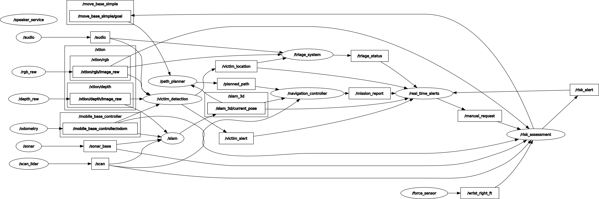

# Cognitive Architecture Scenarios for Post-Earthquake Search and Rescue (TIAGo Robot)

## Overview
This repository contains the cognitive architecture developed for the assignment **"Post-Earthquake Scenarios Search and Rescue"** using the TIAGo robot platform.

The purpose is to enable TIAGo to operate autonomously after an earthquake, assisting human rescuers by:
- 3D mapping of the environment for navigation.
- Performing autonomous navigation, dynamically adapting to environmental changes.
- Searching for injured individuals and transmitting their location.
- Assessing the condition of detected victims.
- Evaluating structural risks such as cracks and unstable walls.
- Sending critical reports in real-time to human supervisors.
- Notifying the mission's completion and awaiting further instructions.

This project is a dummy prototype for integration testing and design validation purposes.

---

## Architecture
The architecture is designed based on a **modular component-based approach** to ensure scalability and robustness.  

### Component diagram
Below is the designed **Component Diagram** representing the modular structure of the system:


### Brief Description
Each component's interface is categorized as either **Stateless** or **Stateful**, **Data** or **Service**, and **Strongly-typed** or **Loosely-typed**.

The system contains key subsystems including the following components:
- **TIAGo Robot** : 
    - Physical layer providing motor control, force feedback, audio, and battery monitoring.
    - Components: Left/Right Motor, Left/Right Motor Controller, Left/Right Encoder, Speaker, Microphones, Force Sensor, Battery
- **Perception** 
    - Collects environmental data
    - Components: LiDAR, SONAR, RGB-D Camera
- **Navigation** 
    - Builds the 3D map, handles route planning, and updates position using SLAM.
    - Components: SLAM, Path Planning
- **Structural Risk Assessment** 
    - Processes sensor data to detect cracks and unstable structures.
    - Components: Sensor Fusion, Crack Detection, Image Processing, Weak Walls, Risk Classifier
- **Victim Handling**
    - Detects injured individuals, triages their condition, and handles audio interaction.
    - Components: Victim Detection, Speech to Text, Text to Speech, Triage classifier
- **Communication** 
    - Manages reports, real-time alerts, and manual supervisor requests.
    - Components: Mission Reports, Real-Time Alerts, Graphical User Interface


Design patterns such as **Observer** (for real-time event notifications) and **Strategy** (for flexible triage methods) are suggested for final implementation refinement.

---

## ROS Graph
The following is the system's **ROS graph**, showing topic-level communication between components:



### Key Topics:
- **Mapping and Navigation**: `/slam_3d`, `/move_base_simple/goal`, `/navigation_controller`
- **Victim Handling**: `/victim_detection`, `/victim_alert`, `/victim_location`
- **Structural Assessment**: `/rsk_assessment`, `/rsk_alert`
- **Communication**: `/mission_report`, `/real_time_alerts`
- **Supervisor Inputs**: `/manual_request`
- **Sensor Data Inputs**: `/scan`, `/sonar_base`, `/odometry`, `/xtion/rgb/image_raw`, `/xtion/depth/image_raw`, `/force_sensor`

---

## Repository Structure

```bash
CogArch-SAR-TIAGo/
├── bags/         # Recorded ROS bag files
├── diagrams/     # Diagrams (Component, behavioral diagrams)
├── docs/         # Documentation files (Sphinx generated)
├── launch/       # ROS launch files
├── msg/          # Custom ROS message definitions
├── scripts/      # Scripts for dummy components
├── srv/          # Custom ROS service definitions
├── tests/        # Integration test files
```
---

## How to Run
1. Go to your ros workspace
```bash
cd cognitive_architecture_ros
```
2. Clone the repository
```bash
git clone https://github.com/waleedelfieky/CogArch-SAR-TIAGo.git
```
3. Launch the full system
```bash
roslaunch launch/full_system.launch
```
4. To run integration tests
```bash
roslaunch test/integration_test.launch
```

## Notes
- Behavioral diagrams, KPI descriptions, unit tests, and detailed interfaces for components are provided in the documentation website accompanying this repository.

- Only dummy components are implemented in this repo for the purpose of integration testing.

- Full integration tests ensure message flow correctness and system synchronization.