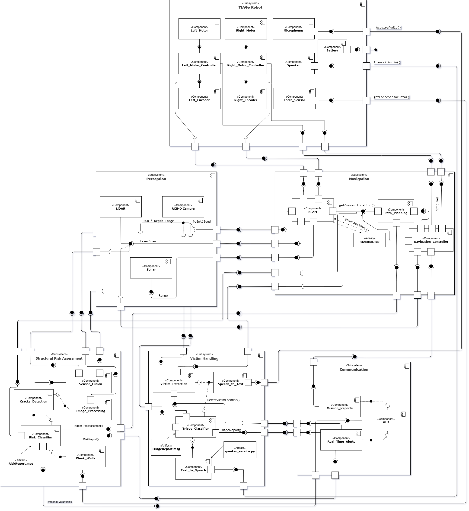

# Cognitive Architecture Scenarios for Post-Earthquake Search and Rescue (TIAGo Robot)

## Overview
This repository contains the cognitive architecture developed for the assignment **"Post-Earthquake Scenarios Search and Rescue"** using the TIAGo robot platform.

The purpose of this project is to enable the TIAGo robot to operate autonomously after an earthquake, assisting human rescuers by:
- **3D Mapping**: Creating a 3D map of the environment for navigation.
- **Autonomous Navigation**: Dynamically adapting to environmental changes.
- **Victim Search**: Locating injured individuals and transmitting their location.
- **Victim Assessment**: Evaluating the condition of detected victims.
- **Structural Risk Evaluation**: Detecting cracks and unstable walls.
- **Real-Time Reporting**: Sending critical reports to human supervisors.
- **Mission Completion Notification**: Notifying the mission's completion and awaiting further instructions.

This project is a **dummy prototype** for integration testing and design validation purposes.

---

## Architecture
The architecture is designed using a **modular component-based approach** to ensure scalability and robustness.

### Component Diagram
Below is the designed **Component Diagram** representing the modular structure of the system:



### Subsystems and Components
The system contains the following key subsystems and components:

#### **TIAGo Robot**
- **Purpose**: Physical layer providing motor control, force feedback, audio, and battery monitoring.
- **Components**: Left/Right Motor, Motor Controllers, Encoders, Speaker, Microphones, Force Sensor, Battery.

#### **Perception**
- **Purpose**: Collects environmental data.
- **Components**: LiDAR, SONAR, RGB-D Camera.

#### **Navigation**
- **Purpose**: Builds the 3D map, handles route planning, and updates position using SLAM.
- **Components**: SLAM, Path Planning.

#### **Structural Risk Assessment**
- **Purpose**: Processes sensor data to detect cracks and unstable structures.
- **Components**: Sensor Fusion, Crack Detection, Image Processing, Weak Walls, Risk Classifier.

#### **Victim Handling**
- **Purpose**: Detects injured individuals, triages their condition, and handles audio interaction.
- **Components**: Victim Detection, Speech-to-Text, Text-to-Speech, Triage Classifier.

#### **Communication**
- **Purpose**: Manages reports, real-time alerts, and manual supervisor requests.
- **Components**: Mission Reports, Real-Time Alerts, Graphical User Interface.

### Design Patterns
- **Observer Pattern**: Used for real-time event notifications.
- **Strategy Pattern**: Enables flexible triage methods.

---

## ROS Graph
The following is the system's **ROS graph**, showing topic-level communication between components:


### Key Topics
- **Mapping and Navigation**: `/slam_3d/current_pose`, `/slam_3d/map`, `/move_base_simple/goal`, `/planned_path`, `/mobile_base_controller/cmd_vel`.
- **Victim Handling**: `/victim_alert`, `/victim_location`, `/triage_status`.
- **Structural Assessment**: `/risk_alert`.
- **Communication**: `/mission_report`.
- **Supervisor Inputs**: `/manual_request`.
- **Sensor Data Inputs**: `/audio`, `/scan`, `/sonar_base`, `/odometry`, `/xtion/rgb/image_raw`, `/xtion/depth/image_raw`, `/wrist_right_ft`.

---

## Custom ROS Messages and Services

### Messages
- **RiskReport.msg**: Contains details about detected structural risks, such as cracks or unstable walls.
- **TriageReport.msg**: Provides information about the condition of detected victims, including their location and health status.

### Services
- **Speaker.srv**: Handles audio communication with victims or supervisors.

---

## Repository Structure

```bash
CogArch-SAR-TIAGo/
├── CMakeLists.txt # CMake build configuration
├── package.xml    # ROS package manifest
├── README.md      # Project documentation
├── bags/          # Recorded ROS bag files
│   ├── arm_jointstate.bag
│   ├── audio.bag
│   ├── depth_raw.bag
│   ├── force_sensor.bag
│   ├── odometry.bag
│   ├── rgb_raw.bag
│   ├── scan_lidar.bag
│   ├── sonar.bag
│   └── user_request.bag
├── diagrams/      # Diagrams (Component, behavioral diagrams)
│   ├── component_diagram.png
│   ├── rosgraph.png
│   └── behavioral_diagrams/
├── docs/          # Documentation files (Sphinx generated)
├── launch/        # ROS launch files
│   ├── bags.launch
│   └── nodes.launch
├── msg/           # Custom ROS message definitions
│   ├── RiskReport.msg
│   └── TriageReport.msg
├── scripts/       # Scripts for dummy components
│   ├── navigation_controller.py
│   ├── path_planner.py
│   ├── real_time_alerts.py
│   ├── slam.py
│   ├── speaker_service.py
│   ├── structural_risk_assessment.py
│   ├── triage_system.py
│   └── victim_detection.py
├── srv/           # Custom ROS service definitions
│   └── Speaker.srv
└── tests/         # Integration test files
│   ├── integration_test.py
│   └── integration_test.test
```

---

## How to Run

Follow these steps to set up and run the project:

### 1. Prerequisites
Ensure you have the following installed on your system:
- **Ubuntu 20.04** (or compatible Linux distribution)
- **ROS Noetic** (installed and properly configured)
- **Python 3** (with necessary dependencies)

If ROS is not installed, follow the [official ROS installation guide](http://wiki.ros.org/noetic/Installation/Ubuntu).

### 2. Set Up a ROS Workspace
```bash
# Create a workspace directory
mkdir -p ~/catkin_ws/src

# Navigate to the workspace
cd ~/catkin_ws

# Initialize the workspace
catkin_make
```

### 3. Clone the Repository
```bash
cd ~/catkin_ws/src
git clone https://github.com/waleedelfieky/CogArch-SAR-TIAGo.git
```

### 4. Install Dependencies
Navigate to the workspace root and install any required dependencies:
```bash
cd ~/catkin_ws
rosdep install --from-paths src --ignore-src -r -y
```

### 5. Build the Workspace
Build the workspace to compile the project:
```bash
catkin_make
```

### 6. Source the Workspace
Source the workspace to make the packages available to ROS:
```bash
source ~/catkin_ws/devel/setup.bash
```

### 7. Run the Project
Launch the project using the provided ROS launch files:
```bash
roslaunch tiago_sar_cogarch nodes.launch
```

### 8. Run the Bags with Nodes
To replay the recorded ROS bag files alongside the nodes, use the `bags.launch` file:
```bash
roslaunch tiago_sar_cogarch bags.launch
```

---

## Integration Testing

To verify the system's functionality, run the integration tests:

```bash
rostest tiago_sar_cogarch integration_test.test
```

---

## Notes
- If you encounter any issues during setup or execution, refer to the ROS logs or the documentation provided in the `docs/` directory.
- Ensure all required hardware and sensors are properly connected if running on a physical robot.