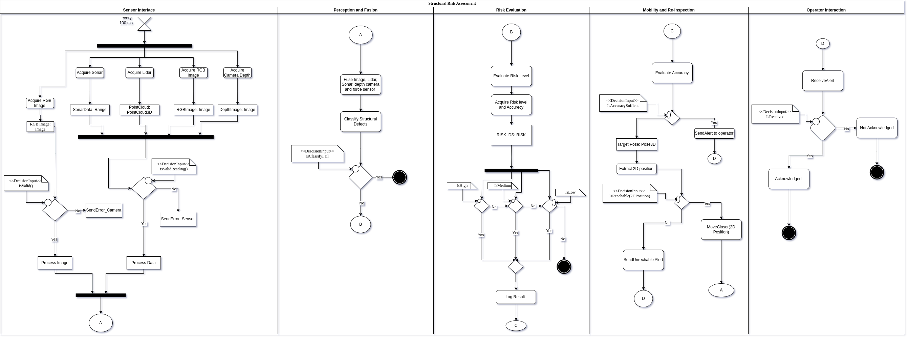

Structural Risk Assessment
==========================

This document describes the detailed flow of the **Structural Risk Assessment** system, represented by the activity diagram.
The diagram is organized into five main sections: **Sensor Interface**, **Perception and Fusion**, **Risk Evaluation**, **Mobility and Re-Inspection**, and **Operator Interaction**.

Each section is responsible for a set of operations crucial to detecting, evaluating, and responding to structural risks.

Diagram Overview
----------------

Sensor Interface
~~~~~~~~~~~~~~~~~

- This section initiates every **100 ms** and manages the acquisition of sensor data.
- The system collects inputs from multiple sources:
  
  * Sonar (producing Range data)
  * Lidar (producing 3D Point Cloud data)
  * RGB Camera (producing RGB Images)
  * Depth Camera (producing Depth Images)
  
- After acquisition, the system validates the RGB image using a decision point:

  * If the RGB Image is invalid, an error is sent via `SendError_Camera`.
  * If valid, the image is processed.

- Simultaneously, the system checks if other sensor readings are valid:

  * If invalid, an error is sent via `SendError_Sensor`.
  * If valid, the sensor data is processed.

- Once processing is complete, the system proceeds to the next section.

Perception and Fusion
~~~~~~~~~~~~~~~~~~~~~~

- In this phase, sensor data (images, Lidar, Sonar, depth camera, and force sensor) are fused together.
- The system then classifies structural defects based on the fused data.
- A decision is made:

  * If classification fails (`isClassifyFail`), the process terminates.
  * If classification succeeds, the system advances to risk evaluation.

Risk Evaluation
~~~~~~~~~~~~~~~

- The system evaluates the **risk level** associated with the classified structural defect.
- Risk level and accuracy are acquired and stored in `RISK_DS`.

- Based on the evaluated risk, the system categorizes the defect into one of three levels:

  * **High Risk**
  * **Medium Risk**
  * **Low Risk**

- Each decision path ensures proper logging or alerts as necessary, followed by a transition to mobility operations.

Mobility and Re-Inspection
~~~~~~~~~~~~~~~~~~~~~~~~~~~

- This section evaluates the **accuracy** of the risk evaluation.

- A decision point checks whether the current accuracy is sufficient:

  * If sufficient, an alert is sent to the operator.
  * If insufficient, the system extracts a **2D Position** from the 3D pose.

- It then assesses the reachability of the target:

  * If unreachable, an alert is sent to inform the operator.
  * If reachable, the system commands a **MoveCloser(2D Position)** action for better data collection and re-inspection.

Operator Interaction
~~~~~~~~~~~~~~~~~~~~~

- This section handles communication between the system and the human operator.
- Upon sending an alert, the system waits for operator acknowledgment:

  * If the alert is received and acknowledged, the system logs the acknowledgment.
  * If not acknowledged, the system records it as "Not Acknowledged" and ends the current interaction flow.

Key Performance Indicators (KPIs):

.. list-table:: KPIs for Structural Risk Assessment
   :widths: 25 35 40
   :header-rows: 1

   * - KPI
     - Metric
     - Success Criteria
   * - 1. Crack Detection
     - Number of cracks detected from RGB images
     - Randomized dummy value [0–4]; verified image input
   * - 2. Wall Anomaly Detection
     - Number of wall anomalies detected from LiDAR scans
     - Randomized dummy value [0–2]; valid LiDAR readings
   * - 3. Hollow Space Detection
     - Number of hollow spaces detected from sonar sensor
     - Randomized dummy value [0–2]; valid sonar readings
   * - 4. Force Magnitude Assessment
     - Computed magnitude of force from wrist force-torque sensor
     - Correct magnitude calculation; force >8N raises risk
   * - 5. Risk Score Evaluation
     - Aggregated weighted risk score based on sensor readings
     - Risk status correctly classified (LOW, MEDIUM, HIGH)
   * - 6. Risk Report Publication
     - Publishing RiskReport message on /risk_alert
     - Timely publication after evaluation
   * - 7. Manual Reassessment Handling
     - Responding to manual "reassess" requests
     - Proper trigger of reassessment procedure
   * - 8. Reassessment Movement
     - Moving robot 1m forward for closer inspection
     - Goal message sent on /move_base_simple/goal
   * - 9. Reassessment Status Notification
     - Publishing status updates on reassessment progress
     - Correct updates on /reassessment_status topic

Code
--------

The full workflow enables:

* Continuous data acquisition from multiple sensors.
* Fusion of sensory information for accurate structural defect detection.
* Risk evaluation with different severity levels.
* Dynamic mobility actions to enhance inspection quality.
* Real-time interaction with human operators to ensure timely decision-making.

This systematic, cyclic approach ensures robustness, reliability, and safety in structural risk assessment scenarios.

.. automodule:: scripts.structural_risk_assessment
   :members:
   :undoc-members:
   :show-inheritance:
